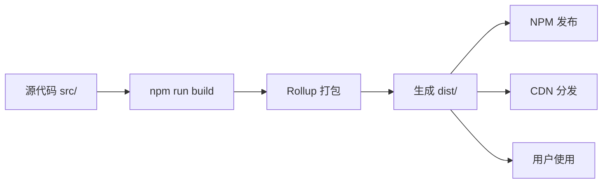

# 📁 DraggableWindow 项目结构

```
DraggableWindow/
│
├── 📄 package.json              # NPM 包配置（包含版本、作者、依赖等）
├── 📄 rollup.config.js          # Rollup 打包配置
├── 📄 .npmignore                # NPM 发布时忽略的文件
├── 📄 .gitignore                # Git 版本控制忽略的文件
│
├── 📘 README.md                 # 项目主文档
├── 📘 QUICKSTART.md             # 快速开始指南
├── 📘 BUNDLING_GUIDE.md         # 打包详细指南
├── 📘 CHECKLIST.md              # 发布前检查清单
├── 📘 NPM_PUBLISH_GUIDE.md      # NPM 发布流程
├── 📘 SUMMARY.md                # 完成总结
│
├── 📜 LICENSE                   # MIT 许可证
│
├── 📂 src/                      # 源代码目录
│   └── DraggableWindow.js       # 核心源码（205 行）
│
├── 📂 dist/                     # 构建产物目录（执行 npm run build 后生成）
│   ├── DraggableWindow.js          # UMD, 未压缩 (~7KB)
│   ├── DraggableWindow.min.js      # UMD, 压缩版 (~3KB) ⭐
│   ├── DraggableWindow.esm.js      # ES Module (~7KB)
│   ├── DraggableWindow.common.js   # CommonJS (~7KB)
│   └── DraggableWindow.d.ts        # TypeScript 类型定义
│
└── 📂 demo/                     # 示例页面目录
    ├── demo.html                # 完整功能演示（区域拖拽）
    ├── bundle-test.html         # 打包版本测试页面
    ├── npm-example.html         # NPM 使用示例
    └── quick-test.html          # 快速功能测试
```

## 📊 文件大小统计

### 源代码
- `src/DraggableWindow.js`: ~7KB (205 行)

### 构建产物（压缩后）
- `dist/DraggableWindow.min.js`: ~3KB ⭐
- `dist/DraggableWindow.js`: ~7KB
- `dist/DraggableWindow.esm.js`: ~7KB
- `dist/DraggableWindow.common.js`: ~7KB
- `dist/DraggableWindow.d.ts`: <1KB

### 文档
- `README.md`: ~9KB
- `BUNDLING_GUIDE.md`: ~5KB
- `SUMMARY.md`: ~6KB
- `CHECKLIST.md`: ~4.5KB
- `NPM_PUBLISH_GUIDE.md`: ~3.8KB
- `QUICKSTART.md`: ~1.7KB

## 🎯 核心文件说明

### 配置文件

| 文件 | 作用 | 重要性 |
|------|------|--------|
| `package.json` | NPM 包元数据、脚本命令 | ⭐⭐⭐⭐⭐ |
| `rollup.config.js` | Rollup 打包配置 | ⭐⭐⭐⭐⭐ |
| `.npmignore` | 控制 NPM 发布内容 | ⭐⭐⭐⭐ |
| `.gitignore` | 控制 Git 版本控制 | ⭐⭐⭐⭐ |

### 源文件

| 文件 | 说明 | 行数 |
|------|------|------|
| `src/DraggableWindow.js` | 核心拖拽逻辑 | 205 行 |

### 构建产物

| 文件 | 格式 | 用途 |
|------|------|------|
| `DraggableWindow.min.js` | UMD | 浏览器直接使用（生产环境） |
| `DraggableWindow.js` | UMD | 浏览器直接使用（开发调试） |
| `DraggableWindow.esm.js` | ES Module | Vite/Webpack/Rollup |
| `DraggableWindow.common.js` | CommonJS | Node.js/Webpack |
| `DraggableWindow.d.ts` | TypeScript | 类型定义 |

### 文档文件

| 文档 | 适合人群 |
|------|----------|
| `README.md` | 所有用户 |
| `QUICKSTART.md` | 新手用户 |
| `BUNDLING_GUIDE.md` | 开发者 |
| `CHECKLIST.md` | 发布者 |
| `NPM_PUBLISH_GUIDE.md` | 发布者 |
| `SUMMARY.md` | 快速了解项目 |

## 🔄 工作流程



## 📦 NPM 包结构

当用户执行 `npm install @aggbond/draggable-window` 时，会下载：

```
node_modules/@aggbond/draggable-window/
├── dist/
│   ├── DraggableWindow.min.js      ⭐ 主要入口
│   ├── DraggableWindow.common.js   # Node.js 入口
│   ├── DraggableWindow.esm.js      # ES Module 入口
│   └── DraggableWindow.d.ts        # TypeScript 类型
├── README.md
└── package.json
```

**注意**: 根据 `.npmignore` 配置，以下文件**不会**发布到 npm：
- `src/` - 源代码
- `demo/` - 示例页面
- `rollup.config.js` - 构建配置
- `.git/` - Git 版本控制
- 其他开发相关文档

## 🎨 颜色标识

在以上文档中：
- 🟢 **绿色** - 推荐/重要
- 🔵 **蓝色** - 信息/链接
- 🟡 **黄色** - 提示/注意
- 🔴 **红色** - 警告/错误

## 📈 项目统计

- **总文件数**: ~15 个
- **代码行数**: ~205 行（核心代码）
- **文档字数**: ~30,000+ 字
- **支持格式**: 4 种（UMD, ESM, CJS, Types）
- **示例页面**: 4 个
- **支持语言**: JavaScript + TypeScript

---

**最后更新**: 2026-03-04  
**版本**: v1.0.0
